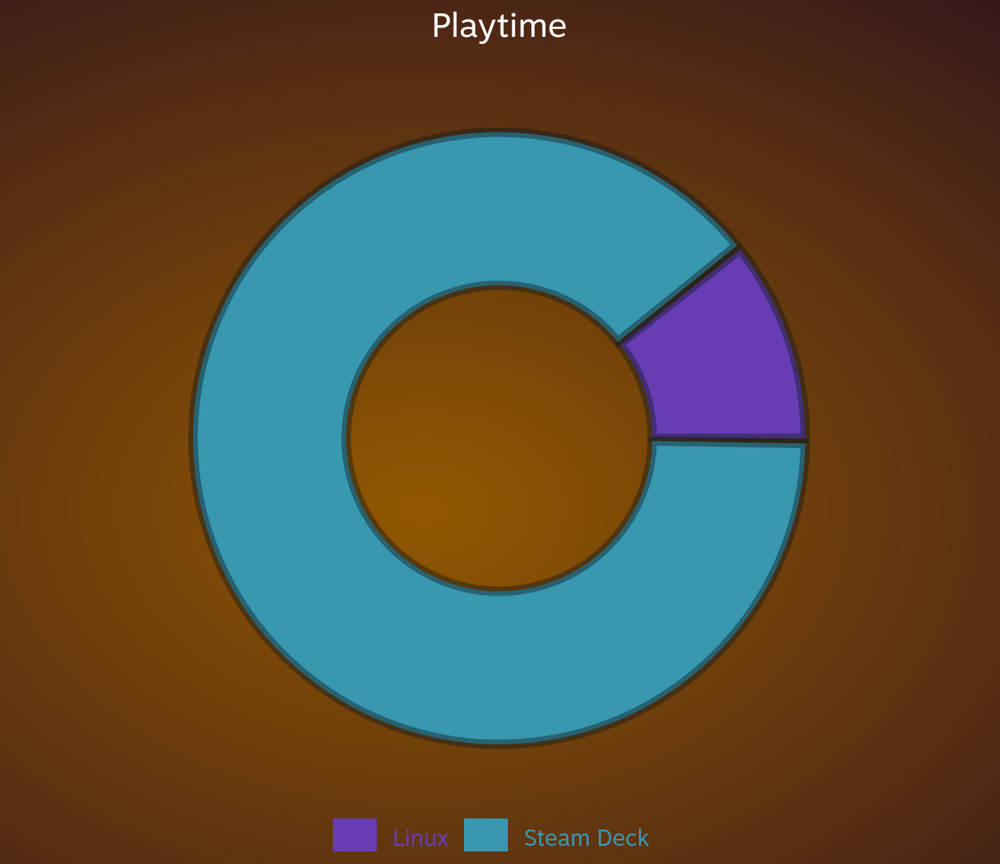
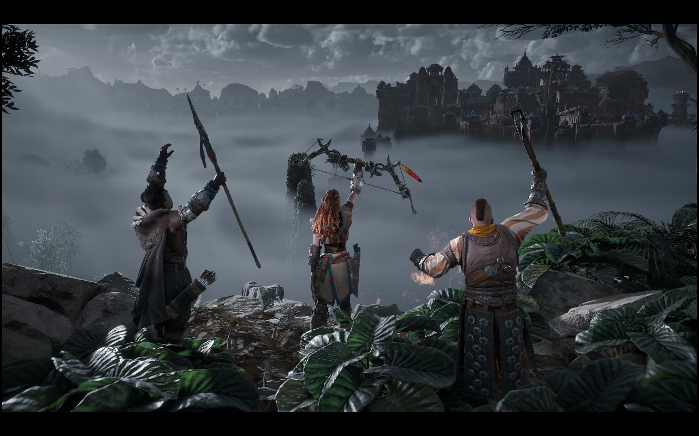
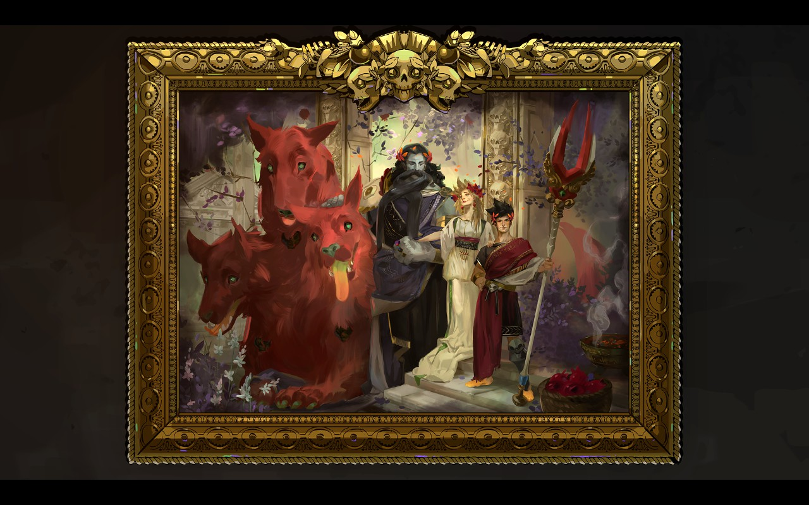
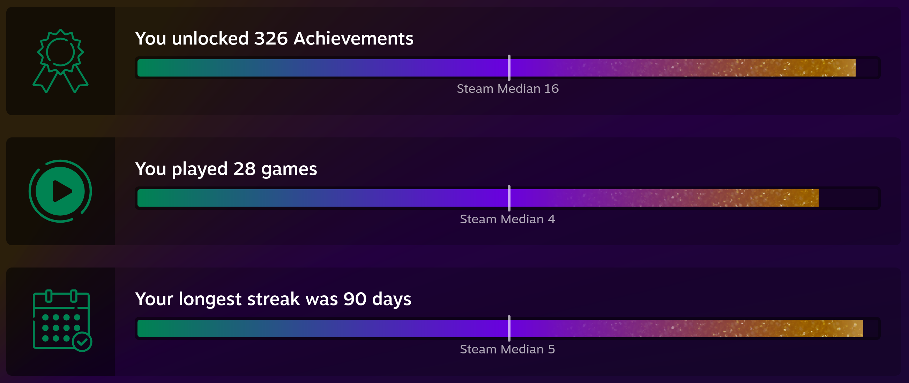
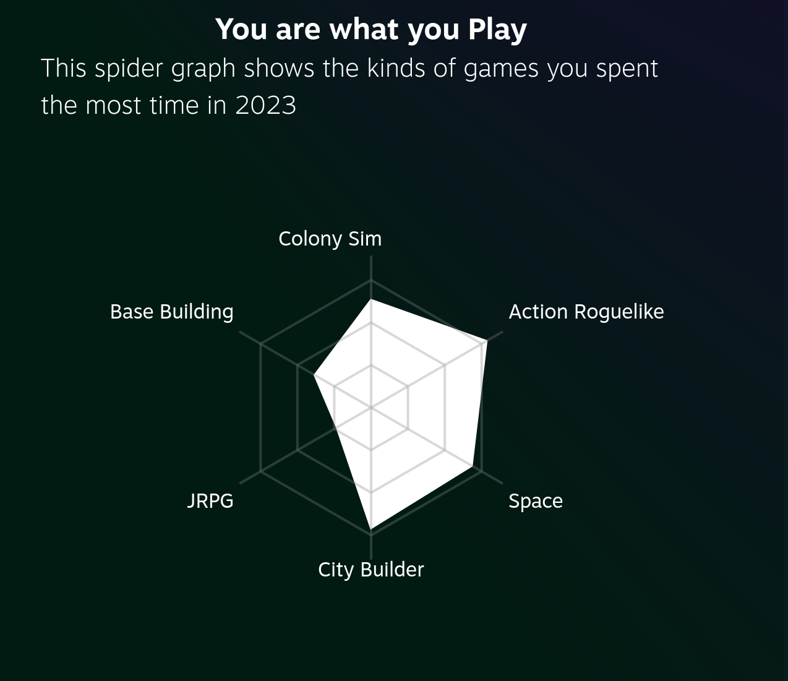

There’s this tradition I’ve been following for over 2 decades now. At the end of every year, I’d make a post with a brief summary of what happened, how it all went down, and what are my hopes for the year ahead. Let’s get started, shall we?

## Work

Work got intense, then weird, then even more weird and more intense but more focused. This is a fairly general summary of my year at work. I worked a lot with unfamiliar tech (primarily, `Kubernetes`), and learned a lot as a result. For example, I've [moved this website](/blog/vercel-to-kubernetes) and a few other projects to my own `k8s` cluster, and enabled a really neat CI/CD pipeline. There were a lot of changes, a lot of motion, and it's yet to be seen how all this stuff will affect my corner of Okta. Personally, I feel like I've grown a lot as an engineer, but we'll see if I actually did when annual performance evaluation happens early next year.

I worked on a couple of interesting projects. Some of them were purely internal-facing productivity tools for account managers (with ML and a bunch of other fun stuff), some were customer facing, and others were explicitly security related. All of this was fun and, of course, challenging. 

Oh, and I've got a new manager. I'm a bit sad that today is their last day at Okta. So, tomorrow I'll have an even newer manager. On the bright side, both the new one and the newer one are pretty awesome.

## Life

Life got quiet, even quieter than before. We camped quite a bit this year, went to San Juan island for the second year in a row; we love it there. I didn't hike, like, at all. I rarely leave the house in general. 

Went to a few concerts, including Ed Sheeran's one, from which we returned with our first COVID infection. The COVID part wasn't fun; the concert was great!

Our child graduated from high school, got their driver's license, and now works a retail job. It's really cool to see this grown up begining _to adult_.

My spouse, among other things, is a Teamster now.

I kept running [Lounge Town](https://lounge.town); it cost me roughly **$1,000** this year, but it brings joy and fun to hundreds of people. Totally worth it. 

## Books

I've read a bunch of books, and re-read some more (think "The Murderbot Dairies"). These are the books I've enjoyed this year:

  - Red Team Blues
  - Silo (the whole thing)
  - Dune (finally, don't judge)
  - System Collapse
  - Lost in Time
  - The Witch King (started, halfway through already)

The old site used to have a library of all my books, so once I re-empliment this feature, I'll update the books above with proper links. Same goes for the games below. 

## Games

Games were a bright spot in 2023. I enjoyed playing on my Deck, primarily, and a little bit on my monster of a desktop:

Really loved Horizon Zero Dawn:

Hades is another amazing game:

It turns out, I played quite a lot. I mean, I know I played for hundreds of hours, but didn't realize _how much_ it was! 

You are what you play, I guess:

These are my favorite games this year:

  - Horizon Zero Dawn (on Ultrahard)
  - Hades
  - Dredge
  - Starfield
  - Cities: Skylines II
  - Dome Keeper
  - Last of Us. Part I
  - Cult of the Lamb
  - Cassette Beasts
  - Lies of P (a bit)
  - Elden Ring (just a bit)
  - Forza Horizon 4 (a little)
  - Stardeus
  - Life Is Strange: True Colors (a bit)
  - Cyberpunk 2077 (a little bit)

## 2024

I don't expect anything good out of 2024. I think I've learned my lesson: the lower the bar, the higher the chances to reach it. With this, I still hope Biden wins the election. I hope Putin dies. I hope Trump goes to prison for the rest of his life. I hope I'm not laid off. I hope my family is healthy and overall does well. Perhaps, we'll survive 2024, which would be pretty neat. Even if it's just the last hope that 2024 delivers, I'd be very glad. 

On a more down-to-earth note, I really want to hike a bit next year. I want to travel somewhere where water is warm (think Cabo or Cancun kind of place). I want to finish a couple of my hobby projects (I struggle a lot with finishing projects. But starting projects? Not so much.)

## Previous installments

- [2022](/blog/2022-a-year-in-review)
- [2021](/blog/2021-the-year-in-review)
- [2020](/blog/2020-wont-be-missed)
