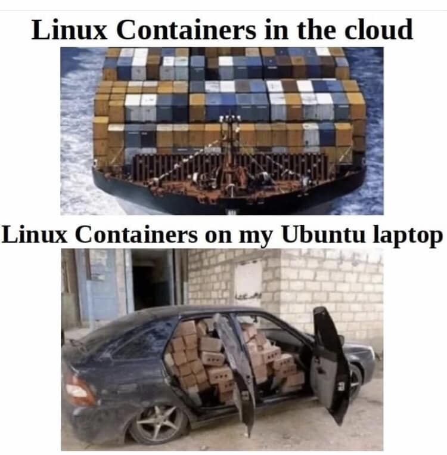
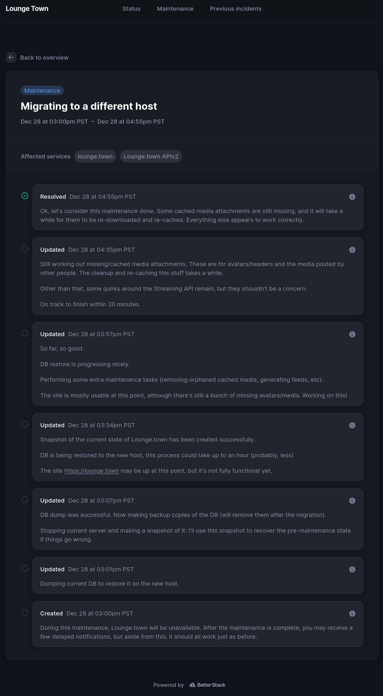
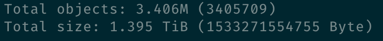
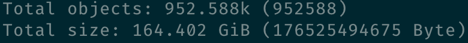
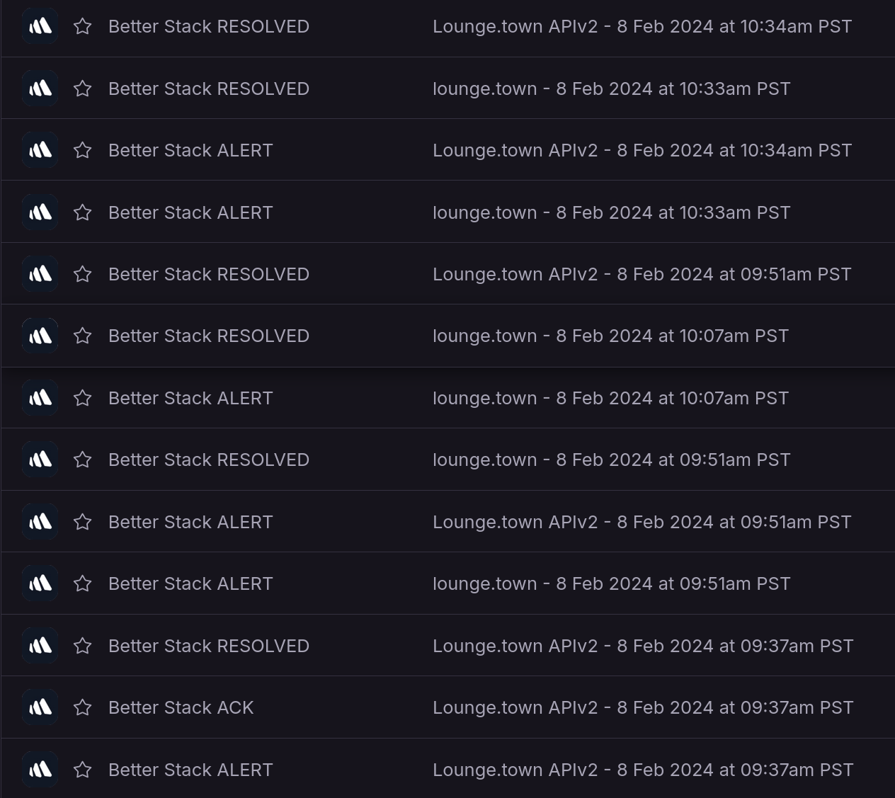

# Why

Let me start here so that there are no misunderstandings down the road. I've been running a small instance of Mastodon for just over a year. It was hosted in Digital Ocean, and it worked very well. There were two key reasons to migrate, though:

- Cost of hosting on Digital Ocean
- Learning opportunity

## Cost of hosting on Digital Ocean

Before the migration, I was paying around $60-$80 per month for the Droplet I was using to host [Lounge.town](https://lounge.town). In a way, it's my own fault that the cost ballooned so much: it started as a fairly reasonable 20-30 bucks per month, but as influx of users just kept coming monthly, I (thought that I) had to keep upgrading the Droplet to keep up with the demand. As soon as I'd got a notification from Digital Ocean that CPU usage exceeded 80%, or RAM was running high, or disk utilization was approaching 90%, I'd upgrade to the next tier. This happened a few times, and before I knew it, I was paying $80+ per month for a Droplet that was running this one service.

Now, [Lounge.town](https://lounge.town) is a smaller instance. At one point it did have over 1500 active users but at this point, it's down to about 100 people who use it daily. It's funded entirely by yours truly, and donations do not really make any dent in the cost of running it (I collected something like $25 in total in 2023). So, I had to find a way to cut costs. 

## Learning opportunity

I've been working with Kubernetes at work for a few months, and got a pretty good grasp of how it works and how I may benefit from using it myself. I've got a ton of little side projects (including this blog) that require some sort of hosting. Managing and juggling multiple Docker containers, each with its own configuration, is not fun. Deploying whatever it is that I'm playing with this weekend to Kubernetes, on the other hand, is a breeze. Well, I shouldn't say "breeze" - it's still quite a bit of work, but every time I do it, I learn something new. With this in mind, I've [migrated this blog](/blog/vercel-to-kubernetes) to a small cluster I've set up on [Hostinger VPS](https://hostinger.com/?REFERRALCODE=1ART641) (referral link, you get a discount and I get one too!). Now, what's left is to migrate [Lounge.town](https://lounge.town) to Kubernetes as well.

# What

Mastodon is not a single binary you can just run wherever you want and be done with it. It has multiple moving parts, including a database, a web server, a streaming server, and a background worker. It's a bit of a pain to set up, but once it's running, it's fairly easy to maintain, even on bare metal. 

`Docker compose` makes running a Mastodon instance as painless as it gets. With a single command, you can spin up all the necessary services, restart them to upgrade, perform maintenance, and so on. It's a bit more complicate than this, but you get the idea.

Now, Kubernetes is... shall I say, a bit _different_? It's an entire world of stuff, from `configMaps` to `clusterIssuers`. It can take care of pretty much _literally_ everything, from networking to storage to security. But in no way is it simple. Even when you're experienced with `k8s`, there are still pitfalls to be aware of, and things to watch out for. Managed services (think [EKS](https://www.amazonaws.cn/en/eks/) and alike) take care of some of the complexity, but they are **EXPENSIVE**. And I don't mean "a bit more expensive than running a single EC2 instance" expensive. I mean "I could buy a car for the price of running this cluster for a year" expensive. Sure, you can cut some costs here and there, but it's still a good chunk of change, and there's way less predictability (cloud plans are purposefully confusing and hard to understand, not mention to estimate bills).

So here we are, a cluster of some sort is already up and running, most rough edges are smoothed out, and I'm ready to migrate [Lounge.town](https://lounge.town) to it.

# How

There were multiple ways that I've considered. Whatever path I'd take had to:

- Be fully reversible (if I screwed up, I must be able to roll back to the old setup)
- Not require any downtime (or as little as possible)
- Not affect actual Lounge Town residents in any way
- Be as simple as possible

I've considered a few options.

## Do things by hand

Write manifests by hand for each service, deploy them one by one, make sure everything is in order, then just switch the DNS to point to the new cluster. In many ways, that would've been the best option: I get to learn everything there is to learn, know _exactly_ what I'm doing, and have full control over everything. This option, unfortunately, is surprisingly time-consuming (I tried!), and very (and I mean VERY) error prone. I still think I should do it at some point, but not for this migration.

>> By "by hand" I mean writing raw `YAML` manifests or writing manifests with `kustomize` and similar tools. It's a very involved process, albeit to be fair it's not necessarily _entirely_ manual.

## Use Helm

Helm is a package manager for Kubernetes. It's a bit like `apt` or `pacman` or `brew` for Kubernetes. Essentially, you "install" whatever it is you need to deploy, provide Helm with values it should use for the deployment ("deployment" in general, not Kubernetes `deployment`!) and Helm takes care of the rest. It's really easy, most if not all complexity is abstracted away and hidden from you, but you still get to configure things the way you need within the given Helm chart constraints that is. You lose a lot of control (unless you're willing to dive into the chart itself and manually modify it to your liking), there's quite a bit of "magic" involved, and it's not always clear what's going on under the hood. But if you trust the chart maintainer, it's not easy to screw things up.

## Use a combination of both

This would've been ideal at first, but it could've easily turned into a horror story. Say, I could've used Helm to deploy the database (the chart for this is well-maintaned), use `kustomize` for most other services, and then manually glue everything together. However, I could see how this could've turned into a mess very quickly, and I didn't want to risk it (just think about troubleshooting when something goes wrong!).

At the end of the day, I decided to go with the [semi-official Helm chart for Mastodon](https://github.com/mastodon/chart). I mean, it's official in the sense that it's created by the Mastodon team, but not so official when it comes to its maintenance, updates, support, etc. The `values.yaml` file is a bit of a mess, and it's not always clear why certain value is there (and other values are not). It also appears to be a bit neglected, but that's open source for ya :)

Anywho, I went ahead:

1. Set up a new namespace for the Mastodon instance. You can do it when you install the Helm chart (there's a CLI option for that)
2. Updated `values.yaml` with what I thought were sensible values.
3. Prior to deploying the chart, I've created a `dev` domain where I could try things first and make sure everything works.
4. Deploying the chart was as simple as a single `helm install` command (with some flags and options, of course).

Immediately, I've got all the things humming: a web server, a streaming server, a background worker, and a database, all this good stuff: I had a newly installed, clean, brand new Mastodon instance. Great, this worked!

Next step was to actually *migrate* the data without disrupting anything. This was a bit more involved: it required migrating the database, the media (which is stored in an S3-compatible storage), and other configuration bits and pieces. I've done it in a few steps:

- provided the new instance with secrets, API keys, and other credentials so that it could pretend to be the old instance when reaching out for, say, some avatars or whatever.
- paused the old instance, made a backup of the database, and then restored it on the new instance
- tested everything to make sure it works through a local port forwarding (there are some quirks with Mastodon that make it hard to test things without a proper domain name)

At this point, I was pretty confident that everything was working. I let the instance to run for a bit, and then switched the DNS to point to the new cluster. 

Surprisingly, everything worked! I mean, there were a few hiccups here and there, but nothing major. The biggest issue was with media caching and images not showing up unless you hard-refresh the page. Aside from this, everything was working as expected. One small thing that is still missing to this day is media cache proxying: I've yet to figure out how to make it work with the new setup. 

As a funny side effect of this whole migration, I've discovered that the media storage had 1.4 TB of cached media just sitting there, doing nothing. I've cleaned it up, and now it's down to a more reasonable 165 GB. The cleanup took a few days, but it was worth it.

Before:

After:

# Now what?

Now I'm paying $300 per year for the entire instance (down from almost $1K!). Is it any faster than before? Not really, maybe a bit. Did I learn something? Absolutely. Is it more reliable? Nope, it ain't :))) Mission accomplished (no, really). 

Sometimes the instance gets wonky, not sure why. In fact, it's been available and fully functional this entire time, yet I've got a bunch of notifications from the monitoring system that it's down. I blame [global wobbling](https://en.wikipedia.org/wiki/Milankovitch_cycles)!

I tried to keep it brief and generic, but if you have specific questions about the migration, feel free to [ask me anything](https://lounge.town/@rosnovsky). I'd be happy to help!
